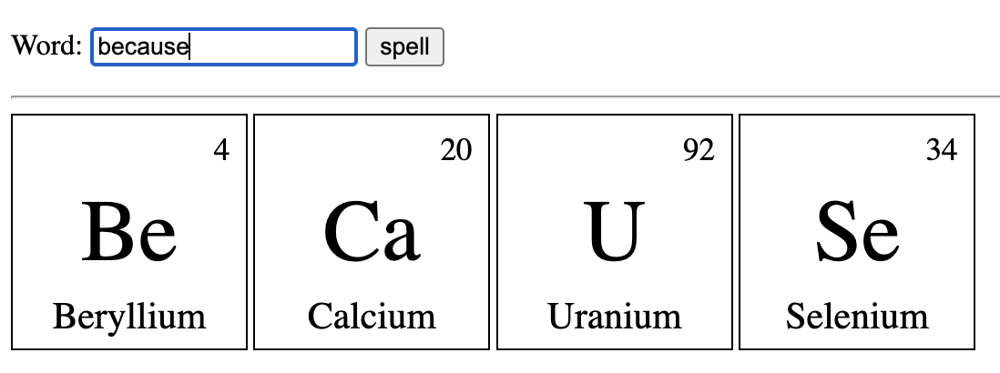

# Solid Periodic Speller
My implementation of Periodic Table Speller App. From [Kyle Simpsons's](https://github.com/getify) workshop on [Thinking in Algorithms](https://frontendmasters.com/workshops/thinking-algorithms/).

This implementation is using [SolidJS](https://www.solidjs.com/).

## Usage
Pick a word and see if it can be spelled using the elements of the periodic table.



## Installation
```bash
npm install
```
## Usage
```bash
npm run dev
```
## Build
```bash
npm run build
```
This will create a `dist` folder with the build files. You can then serve the files with any static server.
## License
MIT (See LICENSE file)